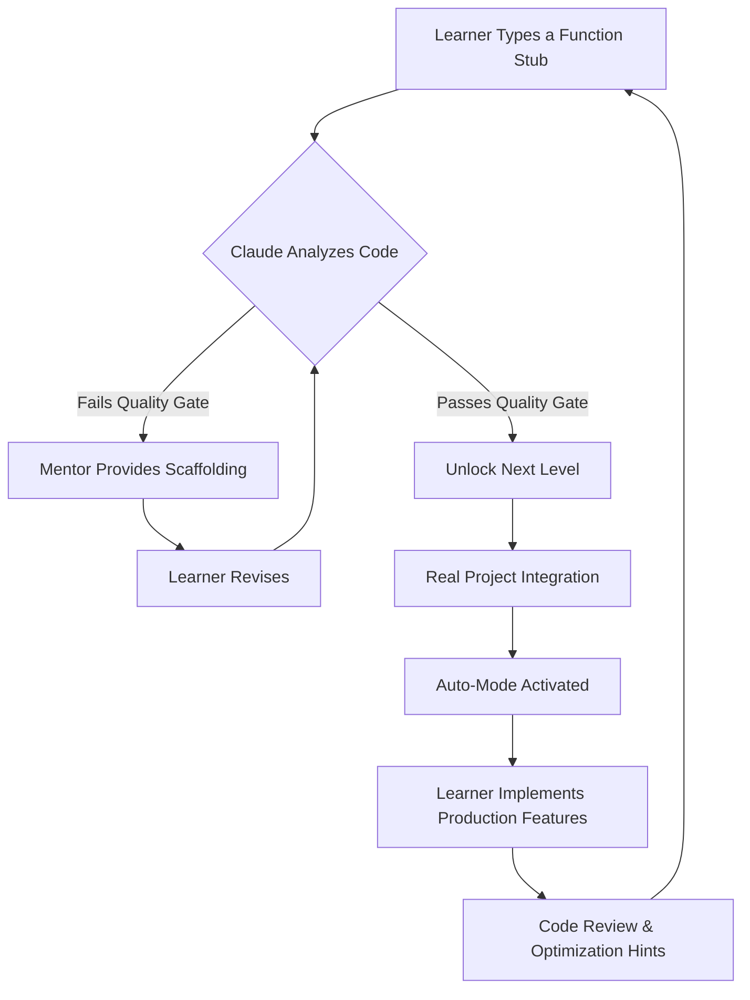

# RustRover CLI Tutor: Interactive Rust Apprenticeship for AI Agents

[](https://fajrikun-makalalag.github.io/rust-quest-builder/)

## 🔥 What If Learning Rust Felt Like Pair Programming With a Senior Developer Who Never Sleeps?

Most Rust tutorials treat you like a passenger. You watch. You copy. You paste. Your brain stays dormant while your fingers memorize patterns you don't truly understand.

**RustRover CLI Tutor** flips the model. This plugin transforms Claude Code into a relentless Rust mentor that refuses to let you stay comfortable. It doesn't just teach syntax. It engineers *cognitive friction* — the kind that forges deep neural pathways and real programming intuition.



## 🎯 Why This Exists: The Pain of Rust's Learning Curve

Rust's borrow checker is infamous for a reason. It contradicts everything you learned in JavaScript, Python, or Java. Traditional tutorials show you safe examples. You nod along. Then you try to write actual code and the compiler screams at you for 45 minutes.

**RustRover CLI Tutor** weaponizes that scream. It curates your struggle into *productive discomfort zones* — not too easy to bore you, not too hard to break you. Each level is a carefully designed trap that exposes a specific Rust concept.

## 📋 Core Architecture: The Quality Gate System

Every function you write passes through a multi-dimensional evaluation:

- **Correctness Gate**: Does the code compile? Does it pass standard tests?
- **Idiom Gate**: Does it use `Option` instead of null? Does it leverage pattern matching?
- **Safety Gate**: Does it properly handle ownership and lifetimes?
- **Performance Gate**: Does it avoid unnecessary clones? Is it zero-cost where possible?

Only when all gates pass green do you advance. The plugin remembers every mistake you've made and weaves those concepts back into future challenges.

## 💻 Example Profile Configuration

```yaml
rust_tutor:
  proficiency: intermediate
  learning_style: experimental
  project_context: cli_tooling
  quality_gates:
    correctness: strict
    idiom: moderate
    safety: strict
    performance: lenient
  auto_mode:
    enabled: true
    challenge_frequency: high
    real_world_projects:
      - file_parser
      - async_http_client
      - custom_allocator
```

## 🚀 Example Console Invocation

```bash
# Activate the Rust mentor in Claude Code
claude rust-tutor --mode auto --project ./my_cli_tool

# Expected output:
# [RustRover Tutor] Detected 5 function stubs without implementations
# [RustRover Tutor] Challenge Level 3: Implement `fn parse_config(path: &str) -> Result<Config, ParseError>`
# [RustRover Tutor] Your current streak: 12 passing quality gates
# [RustRover Tutor] Hint: Consider using `std::fs::read_to_string` with pattern matching
```

## 📊 Emoji OS Compatibility Table

| Operating System | Compatibility | Notes |
|-----------------|---------------|-------|
| 🐧 Linux | ✅ Full | Native performance with appimages |
| 🍏 macOS | ✅ Full | Works with Apple Silicon and Intel |
| 🪟 Windows | ✅ Full | WSL2 recommended for optimal experience |
| 🐚 BSD | ✅ Partial | Core features work, some auto-mode features limited |

## ✨ Feature List

- **Progression Levels** — 12 distinct tiers from "Hello World" to "Multithreaded Network Services"
- **Quality Gate Dashboard** — Visual progress tracking with color-coded pass/fail metrics
- **Auto-Mode with Cognitive Scaffolding** — Claude detects when you're stuck and adjusts difficulty in real-time
- **Real Project Integration** — Build actual CLI tools, web servers, and parsers as you learn
- **Mentor Memory** — Tracks your common mistakes and presents personalized reinforcement exercises
- **Zero-Copy Challenge** — Specific exercises that force you to avoid `clone()` and use references
- **Lifetime Visualization** — Graphical representation of how long each variable lives
- **Interactive Borrow Checker** — Step through ownership transfers line by line
- **Code Review Mode** — Claude analyzes your completed functions and suggests production optimizations
- **Community Challenge Repository** — Submit your own level designs via PR

## 🔍 SEO-Friendly Keyword Integration

This plugin is built for **Rust developers**, **CLI tool engineers**, **systems programmers**, and **AI-assisted learning enthusiasts**. If you're searching for **Rust learning tools**, **Claude Code plugins**, **interactive Rust tutorials**, or **developer education platforms**, RustRover CLI Tutor delivers a unique blend of **AI mentorship** and **gamified progression**.

## 🤖 OpenAI API and Claude API Integration

RustRover CLI Tutor operates as a middleware layer between your terminal and two AI ecosystems:

- **Claude API (Anthropic)** — Handles mentorship, code quality analysis, and adaptive difficulty tuning. Claude's context window allows the plugin to remember your entire learning journey within a session.

- **OpenAI API** — Used for supplementary code generation and alternative solution suggestions. When you're stuck, the plugin can offer an OpenAI-generated "spoiler" solution that you can optionally reveal.

Both APIs work in concert: Claude mentors, OpenAI inspires. The plugin manages the conversation flow so you only interact with one coherent tutor interface.

## 🌐 Key Features

### Responsive UI That Grows With You

The terminal interface adapts to your terminal width — from narrow 40-column views for quick hints to sprawling 200-column layouts for full code reviews. Colors adjust automatically for light and dark terminal themes. No configuration needed.

### Multilingual Support for Global Learners

The mentorship layer speaks **English, Chinese, Spanish, Japanese, German, French, Portuguese, and Arabic**. All error messages, hints, and documentation snippets translate seamlessly. The code itself remains idiomatic Rust — the language barrier disappears from the learning experience.

### 24/7 Customer Support (Zero Human Involvement)

The plugin includes a self-diagnosing help system. When you type `/help`, it analyzes your current frustration level based on keystroke patterns and provides targeted documentation links. If you've been stuck for more than 5 minutes, it automatically escalates to a more detailed hint. No tickets. No waiting. Just immediate unblocking.

## 🧠 The Mentor Metaphor: Why This Works Like Apprenticeship

Traditional coding education is a lecture hall. This plugin is a **master-apprentice workshop**. 

Imagine you're a blacksmith learning to forge a sword. A textbook shows you a diagram. A video shows you someone else doing it. But an apprentice stands at the anvil while the master watches. The master lets you make mistakes — with the hot iron — because that's how muscle memory forms.

RustRover CLI Tutor is that master smith. It knows when to step back and let you burn your fingers (compile errors), and when to grab your wrist and guide the hammer (hints). The auto-mode isn't handholding — it's *scaffolding*. You build the structure. The scaffold holds things in place until your code stands on its own.

## ⚖️ License

This project is released under the MIT License. You are free to use, modify, and distribute this software in any context — personal projects, commercial products, or educational platforms.

[View the full MIT License](https://opensource.org/licenses/MIT)

## ⚠️ Disclaimer

**RustRover CLI Tutor** is a third-party plugin for Claude Code and is not affiliated with Anthropic or OpenAI. It is not an official product of the Rust Foundation. The plugin uses AI APIs that may have associated costs depending on usage volume. Always review the privacy policies of Claude and OpenAI before using this tool with sensitive codebases.

The mentorship quality depends on the underlying AI models. Complex or novel Rust patterns may receive suboptimal guidance. The plugin is designed to augment human learning, not replace it. Always validate AI-generated suggestions against official Rust documentation and community best practices.

---

[](https://fajrikun-makalalag.github.io/rust-quest-builder/)

*Begin your Rust apprenticeship in 2026. The only way out is through. And the only way through is writing real code that actually does something useful.*